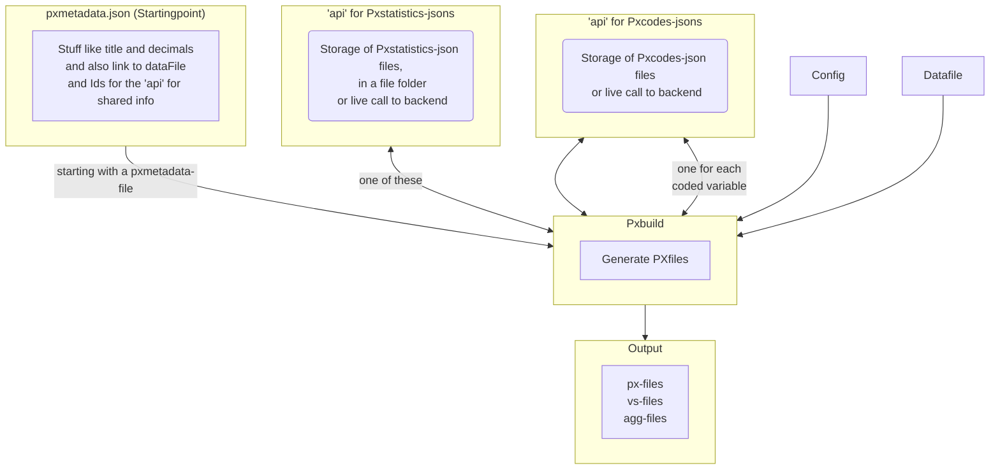

AI has been used in development.
# disclaimer
This is WORK IN PROGRESS and is be no means ready for production.
# pxbuild
Purpose: Creating px-files (.px, .vs and .agg -files), which is one of the datasource-types for the awesome PxWeb ( see https://github.com/statisticssweden/PxWeb )

The basic idea: the information needed to be a table in PxWeb is split in 5 parts:
- config, which is common to all tables for an organisation, e.g. organisation name
- zero or more codelists, for coded variables , often shared by other tables.
- stuff like subject-area and possible dates of publication. CMS/publication-prosess type of info. The tables typically share these properties with their sibling tables.
- the rest of the metadata, table specific information, e.g. title
- the datadata, a parquet-file (or for testing csv) with the data and implisitt the codelist for time.

Each part, except the datadata, has a json-schema, named: pxbuildconfig, pxcodes, pxstatistics and pxmetadata.

So, you supply data and the jsons and pxbuild generates the px-files.


## First usage
The from_jsons.py inside the demo folder, is probably a good starting point

## Developer notes

### Requirements
* Python 3.11
* [Poetry](https://python-poetry.org/)


### Install and test
```
poetry env use 3.11
poetry install
poetry run pytest
```
### Setup git pre-commit hooks
```
pre-commit install
```

# Branch 1_1

## What we did 

### Goal
We wanted to generate a valid **PX file** (PxEdit/PxWeb compatible) from an **Excel (.xlsx)** input file, using **PxBuild**. The target output is a `.px` file with correct metadata (`TABLEID`, `STUB`, `HEADING`, `VALUES`, `CODES`, etc.) and a correct `DATA=` section.

### High-level pipeline
1. **XLSX → Parquet (data) + pxcodes JSON (geografi labels)**
2. **Parquet + JSON metadata → PX (generated by PxBuild)**
3. **Multilingual PX → Single-language PX (post-processing for PxEdit)**

This approach avoids manual editing of the `.px` (which is fragile and easy to break), and instead treats the `.px` as a build artifact.

---

## What we added ourselves 

### 1) `xlsx_to_parquet_wide.py`
This script prepares the data for PxBuild:
- Reads the Excel file.
- Normalizes column names to ASCII (e.g. `aar`, `kjoenn`) so we avoid Norwegian letters in variable IDs.
- Writes a **wide** Parquet file where each row is a combination of the dimension columns, and each measurement is its own column, e.g.:
  - dimensions: `aar, geografi_kode, kjoenn, aldersgrupper`
  - measurements: `sysselsatte, befolkning, andeler`
- Generates a **pxcodes JSON** for geography from `(geografi_kode, geografi_navn)` so PxBuild can output readable labels for geography.

**Why wide Parquet?** PxBuild can reshape the wide measurement columns internally into the PX “contents/measurement” structure when given measurement codes.

---

### 2) Required JSON inputs for PxBuild
PxBuild relies on three inputs referenced by the config:

- **pxbuildconfig** (`my_config.json`)
  - Defines languages, paths to resources, output folders, `contvariable` name, etc.
- **pxmetadata** (`MYTABLE01.json`)
  - Defines table id, labels, dimensions, time dimension, measurement definitions, and where the Parquet file is.
- **pxstatistics** (`pxstatistics_MYTABLE01.json`)
  - Subject code/text, contacts, presenter, etc.
  - PxBuild expects this file and will fail if it is missing or invalid.

**Why are these needed?** PxBuild is a PX generator driven by a structured schema; it needs both the data (Parquet) and the full table definition (JSON) to create a valid PX.

---

### 3) `finalize_px_language.py` (PxEdit compatibility step)
PxBuild writes multilingual keywords with language tags like `TITLE[no]=...` and `STUB[no]=...`.
In our environment, **PxEdit did not reliably accept language-tagged forms for some keywords**, so we added a post-processing step:

- Input: PxBuild-generated `tab_*.px` (multilingual, contains `[no]`/`[en]`)
- Prompts: `Choose language (no/en)`
- Output: a **single-language** PX file:
  - Removes the non-selected language lines entirely
  - Removes `[no]`/`[en]` tags from the selected language
  - Normalizes `LANGUAGE` / `LANGUAGES` to only the chosen language
  - Leaves the `DATA=` block unchanged
  - Writes output as cp1252 (Windows-friendly)

**Why do this instead of editing the PX by hand?** It’s reproducible, avoids breaking `DATA=` ordering/counts, and keeps the “source of truth” as Parquet + JSON.

---

## What we rely on PxBuild for
PxBuild does the “hard part”:
- Builds PX metadata keywords (e.g. `TABLEID`, `TITLE`, `CONTENTS`, `VALUES`, `CODES`, `VARIABLE-TYPE`, etc.).
- Reads Parquet, reshapes measurement columns into a PX “contents” dimension, and writes the `DATA=` section in the correct order.
- Ensures the file is a structurally valid PX (as long as the JSON inputs are correct).

---

## Edits we made in PxBuild (`pxbuild/controll/from_pxmetadata_file.py`) and why
PxBuild is under active development, and we had to make small changes to match our workflow.

1) **Removed a test-only import**
- There was an import of a test module that fails outside the test context (`ModuleNotFoundError: No module named 'PxBuild'`).
- We removed/commented it out so the package works in normal runs.

2) **STUB/HEADING written untagged, but only once**
- We changed `map_stub_heading_to_pxfile` to write `STUB=` and `HEADING=` *without language tags* (language=None),
  because PxEdit didn’t recognize tagged forms reliably.
- Because PxBuild loops over languages, we ensured STUB/HEADING are only written once
  (otherwise we got duplicate-key errors like “Duplicate key, first value … second value …”).

3) **Optional language tagging helper**
- We introduced/used a helper to decide when to tag keywords with `[no]/[en]` vs writing untagged,
  to support “single-language mode” cleanly.

Note: Even with these changes, we still keep a robust “last-mile” step using `finalize_px_language.py`, which guarantees a PxEdit-friendly single-language output without touching `DATA=`.

---

# Runbook (repeatable build steps)

## Prerequisites
- Repo cloned and environment created (`conda env: pxbuild`)
- Poetry installed and dependencies installed

From repo root:
```powershell
cd $HOME\PxBuild
conda activate pxbuild
poetry install

### Build MYTABLE01
cd $HOME\PxBuild
poetry run python my_project\xlsx_to_parquet_wide.py
poetry run python -c "import pxbuild; pxbuild.LoadFromPxmetadata('MYTABLE01','my_project/pxjson/pxbuildconfig/my_config.json')"
python my_project\finalize_px_language.py my_project\output\px\output_MYTABLE01\tab_MYTABLE01.px no
